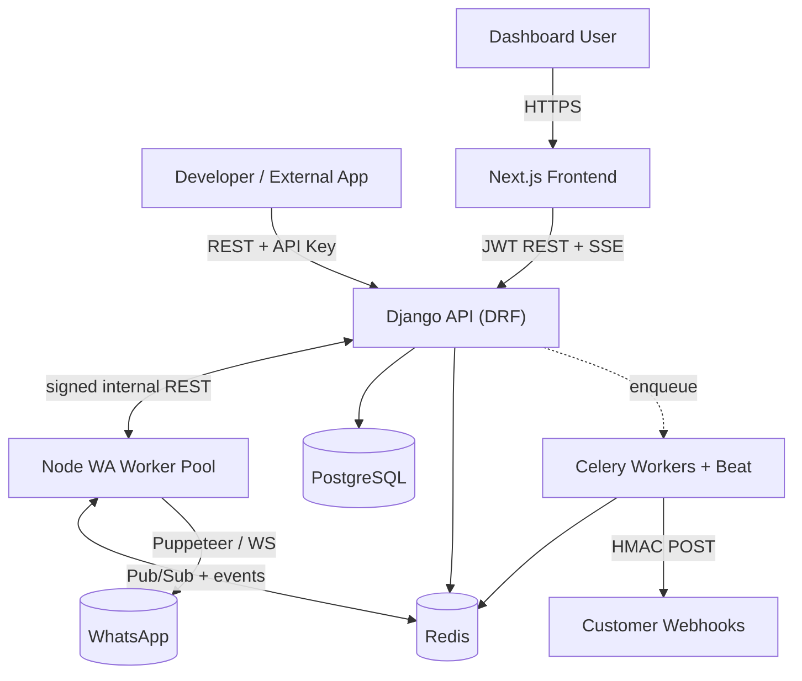

<div align="center">

# waapi-unof

**A self-hostable, multi-tenant WhatsApp API Platform.**

Connect a WhatsApp account via QR, then automate messaging through a clean REST API, webhooks, and a modern dashboard.

[](LICENSE)
[](backend/)
[](frontend/)
[](wa-service/)
[](https://www.conventionalcommits.org/)

</div>

> [!WARNING]
> **Unofficial & use-at-your-own-risk.** This project automates WhatsApp Web and is **not** affiliated with or endorsed by WhatsApp/Meta. Automated usage can violate the [WhatsApp Terms of Service](https://www.whatsapp.com/legal/terms-of-service) and **may result in your number being banned**. The platform ships with anti-ban safety rails (throttling, human-like delays, rate limits), but it cannot guarantee account safety. Do not use it for spam. You are solely responsible for how you use it.

---

## What it is (and isn't)

`waapi-unof` is an **API platform**, built for developers, students, small businesses, and internal tools.

| It **is** | It is **not** |
| --- | --- |
| A REST API + webhooks for WhatsApp automation | A WhatsApp web-client clone |
| Multi-user / multi-device / multi-workspace | A no-code chatbot/flow builder |
| Self-hostable with Docker / Dokploy | A bulk-marketing blast tool |

## Features

- Multi-user, multi-workspace, multi-device
- Scoped, hashed **API keys** + **JWT** dashboard auth
- **QR login** with live status over SSE
- Send **text / media / location / contacts**, plus **group messaging**
- **Incoming message events** + **HMAC-signed webhooks** with retries
- **Scheduler** (one-off & recurring) and **auto-reply** rules
- **Logs**, **analytics**, and **audit logs**
- Local file storage now, **S3-ready** later (storage abstraction)
- Pluggable **WhatsApp engine** — `whatsapp-web.js` today, [Baileys](https://github.com/WhiskeySockets/Baileys)-ready for scale

## Architecture at a glance



The frontend only ever talks to Django. Django orchestrates the Node WhatsApp
service. The Node service does **nothing but WhatsApp**. See
[`docs/architecture.md`](docs/architecture.md) for the full design.

## Tech stack

| Layer | Technology |
| --- | --- |
| Frontend | Next.js (App Router), TypeScript, TailwindCSS, shadcn/ui, React Query, Axios |
| Backend | Django, Django REST Framework, JWT, Celery |
| WhatsApp service | Node.js, Express, ws, whatsapp-web.js (Baileys-ready) |
| Data | PostgreSQL, Redis |
| Infra | Docker, Docker Compose, Traefik (Dokploy) / Nginx |

## Repository layout

```
waapi-unof/
├── frontend/     # Next.js dashboard (UI only)
├── backend/      # Django + DRF API, Celery (business logic, persistence)
├── wa-service/   # Node WhatsApp engine (sessions, QR, send/receive) — WA only
├── nginx/        # Optional reverse-proxy profile (non-Dokploy hosts)
├── docker/       # Docker build helpers, entrypoints, healthchecks
├── scripts/      # Setup / seed / maintenance scripts
└── docs/         # All documentation
```

A full explanation of every directory lives in
[`docs/folder-structure.md`](docs/folder-structure.md).

## Quick start

> The canonical runtime is Docker (on a server or via **Dokploy**). Local
> per-service development is also supported.

```bash
git clone https://github.com/your-org/waapi-unof.git
cd waapi-unof
cp .env.example .env   # then edit values
```

- **Deploy on Dokploy:** follow [`docs/dokploy.md`](docs/dokploy.md)
- **Run with Docker Compose:** follow [`docs/installation.md`](docs/installation.md)
- **Develop locally (per service):** follow [`docs/development.md`](docs/development.md)

## Documentation

| Guide | Description |
| --- | --- |
| [Installation](docs/installation.md) | Prerequisites & first run |
| [Development](docs/development.md) | Local dev workflow per service |
| [Architecture](docs/architecture.md) | System design & decisions |
| [Folder structure](docs/folder-structure.md) | Every directory explained |
| [API](docs/api.md) | Auth, conventions, OpenAPI |
| [Security](docs/security.md) | Security model & best practices |
| [Deployment](docs/deployment.md) | Production deployment overview |
| [Docker](docs/docker.md) | Compose services & volumes |
| [Dokploy](docs/dokploy.md) | Step-by-step Dokploy deploy |
| [Troubleshooting](docs/troubleshooting.md) | Common issues & fixes |

## Roadmap

Built in verifiable phases — see [`docs/architecture.md`](docs/architecture.md#development-roadmap).

`Planning → Architecture → Scaffolding → Docker → Backend → Frontend → WA service → API comms → Auth → QR login → Devices → Messaging → Webhooks → Scheduler → Dashboard → Testing → Docs`

## Contributing

Contributions are welcome! Please read [`CONTRIBUTING.md`](CONTRIBUTING.md) and our
[`CODE_OF_CONDUCT.md`](CODE_OF_CONDUCT.md). To report a vulnerability, see
[`SECURITY.md`](SECURITY.md).

## License

[MIT](LICENSE) © the waapi-unof contributors.
