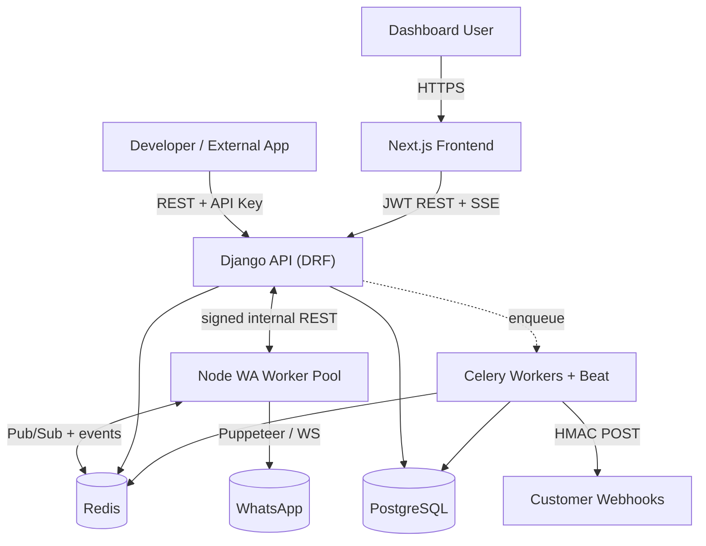
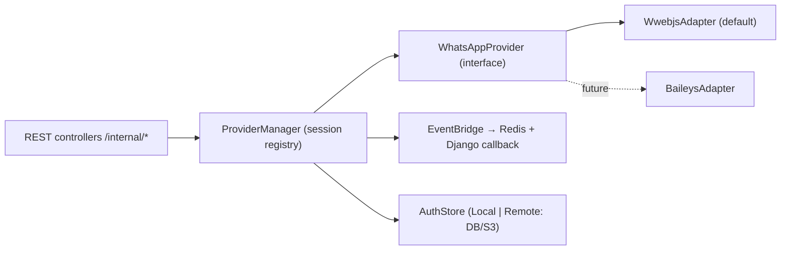
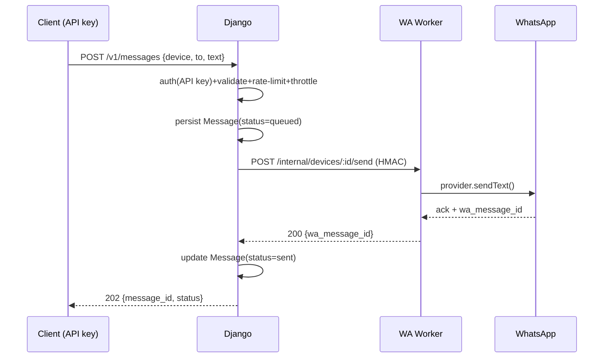
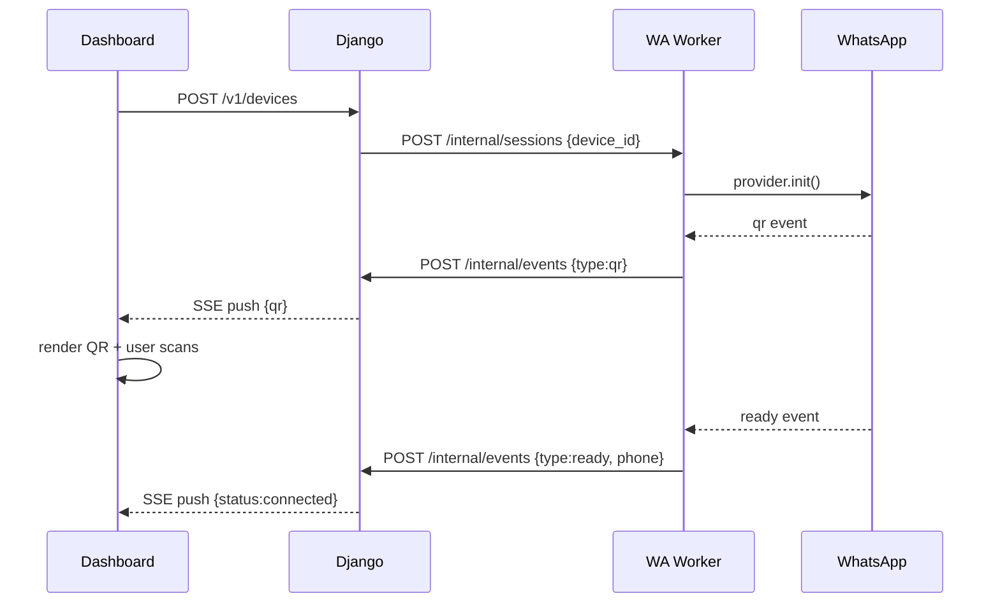
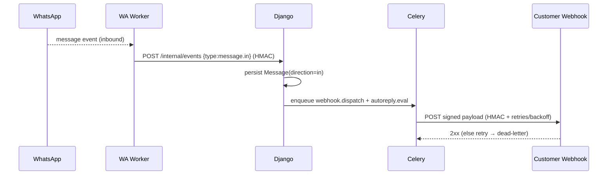
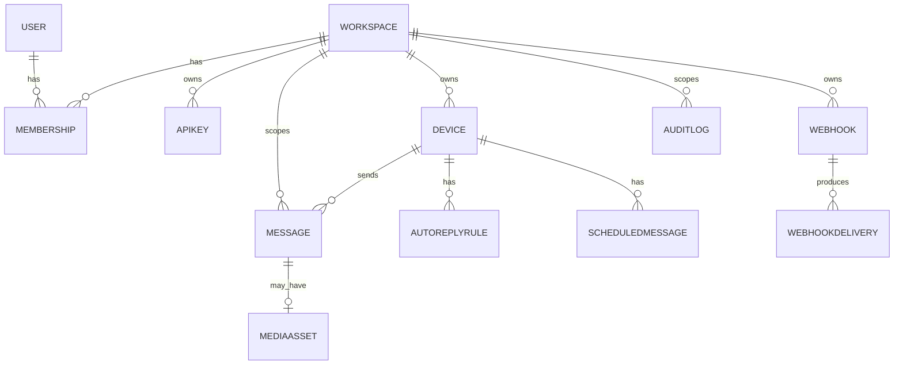

# Architecture

This document describes the system design of `waapi-unof`, the reasoning behind
each major decision, and the development roadmap. It is the canonical reference
for how the platform fits together.

## Table of contents

- [Goals & constraints](#goals--constraints)
- [Key decisions](#key-decisions)
- [System context](#system-context)
- [Services & responsibilities](#services--responsibilities)
- [The WhatsApp provider abstraction](#the-whatsapp-provider-abstraction)
- [Worker pool & session affinity](#worker-pool--session-affinity)
- [Core sequences](#core-sequences)
- [Data model](#data-model)
- [Security](#security)
- [Storage](#storage)
- [Scaling roadmap](#scaling-roadmap)
- [Deployment topology](#deployment-topology)
- [Development roadmap](#development-roadmap)

## Goals & constraints

- **Multi-user, multi-workspace, multi-device** API platform for WhatsApp.
- **Scalable** from 10 → 1,000 → 100,000 users without architectural rewrites.
- **Loosely coupled** services that scale independently.
- **Self-hostable** via Docker / Dokploy; local file storage now, S3 later.

> **Legal note.** Automating WhatsApp Web can violate WhatsApp's Terms of
> Service and risks number bans. Anti-ban throttling is a first-class concern
> (see [Security](#security)). This is an unofficial project; use responsibly.

## Key decisions

| # | Decision | Why |
| --- | --- | --- |
| 1 | **Split Django (platform) and Node (WhatsApp)** | Django gives best-in-class ORM/auth/DRF; Node is the only sane host for `whatsapp-web.js`. Each scales independently. |
| 2 | **WhatsApp engine behind a `WhatsAppProvider` interface** | `whatsapp-web.js` runs a full headless browser (~300–600 MB/session) — expensive at scale. The abstraction lets us swap to [Baileys](https://github.com/WhiskeySockets/Baileys) (no browser, ~10–30 MB/session) later **without touching Django or the frontend**. |
| 3 | **Frontend only talks to Django** | Single trust boundary, single auth surface; the Node service stays internal. |
| 4 | **Events flow Node → Redis + signed callback → Django → SSE → Frontend** | QR codes, status, and inbound messages are push-from-Node. SSE keeps the realtime path simple and robust for one-way pushes. |
| 5 | **Services + Selectors over a literal Repository pattern** | Wrapping the Django ORM in repositories is an anti-pattern. Thin services (writes) + selectors (reads) give clean separation without fighting the framework. |
| 6 | **Row-level multi-tenancy (`workspace_id`)** | Simpler and scalable enough vs schema-per-tenant; partitioning/replicas added at the 100k tier. |
| 7 | **Dokploy-native (Traefik) for prod + optional Nginx profile** | Matches the chosen host; Nginx profile keeps portability to other hosts. |

## System context



## Services & responsibilities

| Service | Stack | Stateless? | Owns |
| --- | --- | --- | --- |
| **frontend** | Next.js (App Router), TS, Tailwind, shadcn/ui, React Query, Axios | Yes | Dashboard UI only |
| **backend (api)** | Django + DRF | Yes | Auth, business logic, persistence, orchestration, public REST, webhook source-of-truth |
| **worker (celery)** | Celery + Beat | Yes | Async jobs: webhook dispatch, scheduled sends, auto-reply eval, analytics rollups |
| **wa-service** | Node + Express + ws + whatsapp-web.js | **No (stateful)** | WhatsApp sessions, QR, send/receive, events. **Nothing else.** |
| **postgres** | PostgreSQL | — | System of record |
| **redis** | Redis | — | Celery broker/result, cache, Pub/Sub, WA session registry, rate-limit counters |
| **reverse-proxy** | Traefik (Dokploy) / Nginx | — | TLS, routing, static assets |

## The WhatsApp provider abstraction

The Node service hides *which* engine is connected behind a single interface, so
the rest of the system never depends on `whatsapp-web.js` specifics.



Interface (conceptual):

```
init(deviceId)        getQR(deviceId)       status(deviceId)
sendText(...)         sendMedia(...)        logout(deviceId)
events: qr | ready | disconnected | message
```

Swapping engines = adding **one adapter file**. No Django or frontend change.

## Worker pool & session affinity

WhatsApp sessions are **stateful**, which is the hardest scaling problem.

- **Session registry in Redis**: `device_id → worker_id` plus heartbeats. Django
  asks the registry which worker hosts a device, then routes the internal call.
- **Portable sessions (RemoteAuth)**: session credentials persist to
  **Postgres/S3**, so a crashed worker's devices can be **re-homed** and
  restored on another worker.
- **Placement**: new devices land on the least-loaded worker. On worker death,
  stale heartbeats trigger re-assignment.
- **Idle hibernation** (scale tier): disconnect idle sessions, restore on demand.

## Core sequences

### Send a message (command path)



MVP is synchronous; at scale Django enqueues to Celery and returns immediately.

### QR login (event path)



### Inbound message + webhook



## Data model



The **Workspace** is the tenant root; nearly every table carries `workspace_id`
and is auto-scoped by a base manager. Full field-level schema is defined in
Phase 5 (Backend).

## Security

- **Two auth schemes**: **JWT** (dashboard) and **API keys** (programmatic).
- **API keys** are stored **hashed** with a public prefix, scopes, revocation,
  and per-key rate limits.
- **Internal trust**: Django ↔ Node calls are **HMAC-signed** and confined to the
  internal network; the Node service is never publicly exposed.
- **Webhooks**: HMAC `X-Signature` so receivers can verify authenticity.
- **Rate limiting**: DRF throttles + Redis token buckets; Node enforces
  per-number send throttling (anti-ban).
- **CSRF**: kept for Django admin / cookie flows; the header-based token API is
  CSRF-exempt by design (documented, not accidental).
- **Audit logs** record sensitive actions. Secrets live only in env vars.

Full detail: [`security.md`](security.md).

## Storage

A `Storage` interface with `LocalStorage` (disk volume) today and `S3Storage`
later. Inbound media: Node pulls it → streams to Django → Django persists via the
backend → a `MediaAsset` row references it. Switching to S3 is config + one class.

## Scaling roadmap

| Tier | Topology | Notable additions |
| --- | --- | --- |
| **10 users** | Single host, all services, 1 WA worker, local storage | Simplicity |
| **1,000** | API & Celery replicas, **WA worker pool**, PgBouncer, S3, RemoteAuth sessions | Session registry + affinity |
| **100,000** | Autoscaled WA fleet, **Baileys provider**, Postgres partitioning + read replicas, NATS/Kafka events, full observability, likely Kubernetes | Provider swap is the cost saver |

## Deployment topology

Production target is **Dokploy** (Docker Swarm + Traefik). A single
`docker-compose.yml` carries Traefik labels for the public services
(`frontend`, `api`). The stateful `wa-service` uses a named volume for session
data. An optional **Nginx profile** supports non-Dokploy hosts. Details:
[`deployment.md`](deployment.md) and [`dokploy.md`](dokploy.md).

## Development roadmap

The platform is built in verifiable phases. Each phase is explained, built,
statically verified (lint/type/build/config), and approved before the next.

| Phase | Goal | "Done" (static) criteria |
| --- | --- | --- |
| 1. Planning | Vision, scope, requirements, risks | This document + plan approved |
| 2. Architecture | System & service design | Diagrams + decisions approved |
| 3. Scaffolding | Repo structure, OSS files, docs | Structure + config in place |
| 4. Docker infra | Compose + Dockerfiles (Dokploy) | Compose config valid; no secrets |
| 5. Backend core | Django skeleton + data model | `manage.py check`, migrations, lint |
| 6. Frontend core | Next.js skeleton + design system | `tsc --noEmit` + `next build` |
| 7. WA service | Node service + provider interface | `tsc` + lint |
| 8. API comms | Django ↔ Node contract (HMAC) | Contract tests (mocked) |
| 9. Authentication | JWT + API keys | Auth unit tests |
| 10. QR login | End-to-end QR via SSE | Flow tested (mocked WA) |
| 11. Device mgmt | CRUD + status + registry | Device tests |
| 12. Messaging API | Send/receive + media + logs | Messaging tests |
| 13. Webhooks | HMAC delivery + retries | Webhook tests |
| 14. Scheduler + auto-reply | Beat + rules engine | Automation tests |
| 15. Dashboard | Full polished UX | `next build` + a11y/lint |
| 16. Testing | Coverage on core flows | CI green |
| 17. Documentation | Complete `/docs` + OpenAPI | Docs complete |
